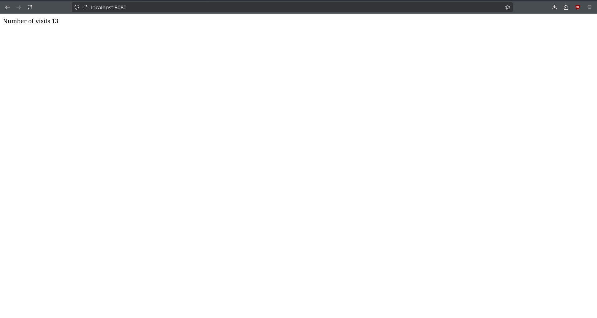

# VisitsDocker
This is a simple Docker application that tracks the numbers of visits to the web page.

## Aim
To build a Docker application to display the total number of visits to a web page.

## Objectives
To make use of docker-compose.yml for streamlined and simple container deployment.

## Tools/Commands
```
docker build .
docker build -t kodi73/visits:latest .
docker run kodi73/visits:latest
docker ps
docker compose up
docker compose up --build
docker compose ps
```
## Output


## Learning Outcomes
1. I learned how to list dependencies and scripts in package.json file.
2. I learned how to create a simple JavaScript page to display the number of visits.
3. I revised how to create a Dockerfile.
4. I learned how to create a docker-compose.yml file to connect all the related containers.
5. I learned how to automatically restart a container in case of failure, stopped by developer, or always restart whenever it shut down.